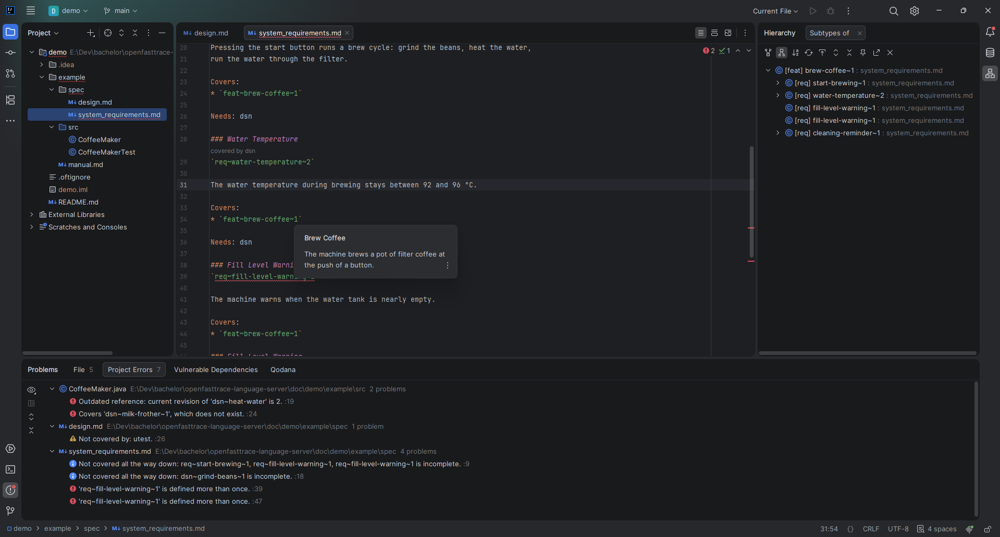

<div align="center">

# OpenFastTrace Language Server

[](https://github.com/fgorke/openfasttrace-language-server/actions/workflows/ci.yml)
[](https://sonarcloud.io/summary/overall?id=fgorke_openfasttrace-language-server)
[](https://open-vsx.org/extension/fgorke/openfasttrace-lsp)
[](LICENSE)

[Feature guide](doc/user-guide/README.md) · [Demo walkthrough](doc/demo/README.md) · [Releases](https://github.com/fgorke/openfasttrace-language-server/releases/)



</div>

## What it does

[OpenFastTrace](https://github.com/itsallcode/openfasttrace) (OFT) is a requirement
tracing suite. It keeps track of whether you actually implemented everything you
planned to in your specifications.

This project brings that into the editor through the
[Language Server Protocol](https://microsoft.github.io/language-server-protocol/).
One server process understands OFT specification items and coverage tags, and any
LSP-capable editor can connect to it. Two clients ship here: an **IntelliJ IDEA
plugin** and a **VS Code extension**.

New to the OFT format? The [OFT user guide](https://github.com/itsallcode/openfasttrace/blob/main/doc/user_guide/user_guide.md)
explains items, coverage and artifact types.

## Features

| Feature                                                             | What it gives you                                                |
|---------------------------------------------------------------------|------------------------------------------------------------------|
| [Syntax highlighting](doc/user-guide/README.md#syntax-highlighting) | Item IDs, section keywords and coverage tags in their own colors |
| [Hover documentation](doc/user-guide/README.md#hover-documentation) | Title and description of the item an ID refers to                |
| [Go to definition](doc/user-guide/README.md#go-to-definition)       | From a tag to the item, from an item to everything covering it   |
| [Find references](doc/user-guide/README.md#find-references)         | Every coverage tag in the workspace that covers an item          |
| [Symbol search](doc/user-guide/README.md#symbol-search)             | Items through the editor's workspace symbol search               |
| [Trace diagnostics](doc/user-guide/README.md#trace-diagnostics)     | Defects of every file, by severity, in the problems view         |
| [Quick fix](doc/user-guide/README.md#quick-fix)                     | Outdated references lifted to the current revision, one or all   |
| [Coverage code lens](doc/user-guide/README.md#coverage-code-lens)   | What an item still needs, shown above its ID                     |
| [Coverage hierarchy](doc/user-guide/README.md#coverage-hierarchy)   | The full chain from feature down to the tags in source           |
| [Code completion](doc/user-guide/README.md#code-completion)         | Item IDs in `Covers:` and tags, plus tag skeletons               |
| [Rename](doc/user-guide/README.md#rename)                           | An item and every reference to it, in one step                   |
| [Trace report](doc/user-guide/README.md#trace-report)               | The full OFT report as HTML or plain text                        |
| [Ignore file](doc/user-guide/README.md#ignore-file)                 | Glob patterns in `.oftignore` keep paths out of the trace        |
| [Trace decisions](doc/user-guide/README.md#trace-decisions)         | An architecture decision record traced like any other item       |

The [feature guide](doc/user-guide/README.md) shows each of them with a screenshot
and the shortcut for both editors.

## Install

Both clients start the server automatically when a supported file is opened. No
configuration needed.

### JetBrains IDEs

Requires a JetBrains IDE **2026.1.4** or later with LSP support. Should work in all of them, only
tested in IDEA Ultimate.

1. Download the plugin ZIP from the [releases](https://github.com/fgorke/openfasttrace-language-server/releases/) page.
2. **Settings → Plugins → ⚙ → Install Plugin from Disk…**, pick the ZIP.
3. Restart when prompted.

### VS Code

Requires VS Code 1.82 or later.

Install from the [Open VSX Registry](https://open-vsx.org/extension/fgorke/openfasttrace-lsp),
or from a downloaded package:

1. Download the `.vsix` for your platform from the [releases](https://github.com/fgorke/openfasttrace-language-server/releases/) page.
2. Open the Extensions view, click the `···` menu and choose **Install from VSIX…**, pick the file.

Each package carries its own Java runtime, so the file name ends in the platform,
for example `-win32-x64` or `-darwin-arm64`.

## Try it

[doc/demo/](doc/demo/) holds a small coffee maker project that visits every feature
in order. Open `doc/demo/example` as the project and follow the
[demo walkthrough](doc/demo/README.md). A few defects in it are intentional, so the
diagnostics, the quick fix and the report have something to show.

## Survey

This language server is the subject of a bachelor's thesis. Taking part is two
steps: first work through the [demo walkthrough](doc/demo/README.md), then answer
the [survey](https://studentische-umfragen.uni-hamburg.de/index.php/842417?lang=en)
right afterwards. The survey builds on the walkthrough, so please do that one
first. Answers are evaluated pseudonymously and used only for the thesis.

## Project information

| Topic         | Details                                                                              |
|---------------|--------------------------------------------------------------------------------------|
| Status        | Bachelor thesis project, work in progress                                            |
| Built on      | Java 17, [LSP4J](https://github.com/eclipse-lsp4j/lsp4j) 1.0.0 (LSP 3.18), OFT 4.9.0 |
| License       | [GPL-3.0-or-later](LICENSE)                                                          |
| Specification | [requirements](doc/spec/requirements.md) · [features](doc/spec/features.md)          |
| Decisions     | [architecture decision records](doc/decisions/)                                      |

## Building from source

<details>
<summary>Server, plugin and extension</summary>

### Prerequisites

* Java 17 or later, Maven 3.6 or later
* Node.js and npm for the VS Code extension
* Gradle comes as a wrapper in `intellij-plugin/`

### Server

```bash
git clone https://github.com/fgorke/openfasttrace-language-server.git
cd openfasttrace-language-server
mvn verify
```

The build produces a standalone fat JAR at
`target/openfasttrace-language-server-*-standalone.jar`. It speaks LSP over stdio,
so any editor with an LSP client can launch it directly:

```bash
java -jar target/openfasttrace-language-server-*-standalone.jar
```

### IntelliJ plugin

```bash
mvn package
cd intellij-plugin
./gradlew runIde        # sandbox IDE with the plugin
./gradlew buildPlugin   # installable ZIP in build/distributions/
```

### VS Code extension

```bash
mvn package
cd vscode-extension
npm install
npm run watch     # then press F5 in VS Code to launch an extension host
npm run package   # .vsix for the current platform
```

`jlink` only builds a runtime for the platform it runs on, so a package built here
carries a runtime for this machine only. The releases are built per platform in CI.

</details>

## Related projects

* [OpenFastTrace](https://github.com/itsallcode/openfasttrace): the requirement tracing suite this server builds on
* [OpenFastTrace IntelliJ Plugin](https://github.com/itsallcode/openfasttrace-intellij-plugin): the native PSI-based IntelliJ integration by the itsallcode team
* [LSP4J](https://github.com/eclipse-lsp4j/lsp4j): the Java binding for the Language Server Protocol

## License

[GPL-3.0-or-later](LICENSE). OpenFastTrace is licensed under GPL-3.0 without a
classpath exception and this project links against it, so the license propagates.
