# Feature Guide

Every feature of the OpenFastTrace Language Server, with the shortcut for both
clients. Keyboard shortcuts are given as **IntelliJ IDEA** / **VS Code**.

Want to try them in order on a prepared example instead of reading?
The [demo walkthrough](../demo/README.md) does exactly that.

| Feature                                     | Description                                       | 
|---------------------------------------------|---------------------------------------------------|
| [Syntax highlighting](#syntax-highlighting) | IDs, keywords and tags get their own colors       |
| [Hover documentation](#hover-documentation) | Title and description of the referenced item      |
| [Go to definition](#go-to-definition)       | Between a tag and the item, in both directions    |
| [Find references](#find-references)         | Every tag covering an item                        |
| [Symbol search](#symbol-search)             | Find items by ID or title                         |
| [Trace diagnostics](#trace-diagnostics)     | Defects of the whole project in the problems view |
| [Quick fix](#quick-fix)                     | Lift outdated references to the current revision  |
| [Coverage code lens](#coverage-code-lens)   | What an item still needs, above its ID            |
| [Coverage hierarchy](#coverage-hierarchy)   | The full chain from feature to source             |
| [Code completion](#code-completion)         | Item IDs and tag skeletons while typing           |
| [Rename](#rename)                           | An item and every reference at once               |
| [Trace report](#trace-report)               | The full OpenFastTrace report in the editor       |
| [Ignore file](#ignore-file)                 | Keep paths out of the trace                       |
| [Trace decisions](#trace-decisions)         | Give an ADR an ID and trace it like a requirement |

---

## Syntax highlighting

Specification item definitions, section keywords such as `Needs:` and `Covers:`,
and coverage tags are reported as semantic tokens, so they follow the color
scheme of your editor rather than a fixed palette.

All optional parts of a tag belong to it: an own revision (`[impl~~2->...]`), an
own name (`[impl~login~2->...]`) and needed coverage (`[dsn->req~login~1>>impl,utest]`).

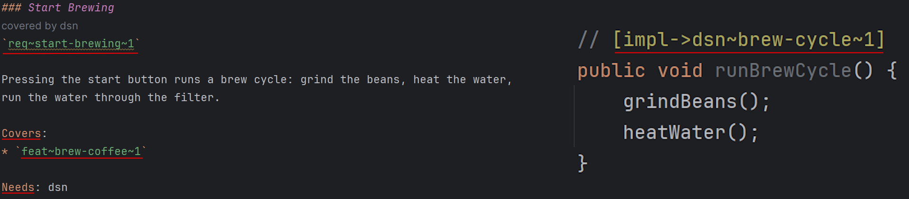


## Hover documentation

Pointing at a specification item ID shows the title and description of the item
it refers to, wherever the ID appears: in a coverage tag, in a `Covers:` list or
on the declaration itself.

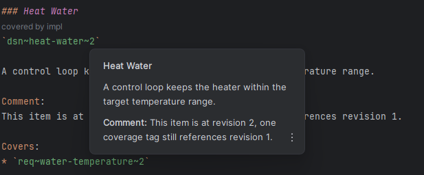

| IntelliJ IDEA | VS Code |
|---|---|
| Mouse over, or `Ctrl+Q` | Mouse over, or `Ctrl+K Ctrl+I` |

## Go to definition

Navigation follows the direction the cursor sits in. On a reference it leads to
the item that is named. On the declaration line of an item it leads the other
way, to everything covering it.

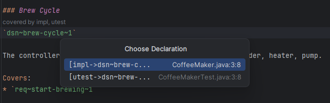

| IntelliJ IDEA     | VS Code           |
|-------------------|-------------------|
| `Ctrl+Left-Click` | `Ctrl+Left-Click` |

## Find references

Lists every coverage tag in the workspace that covers a specification item, with
its file and line.

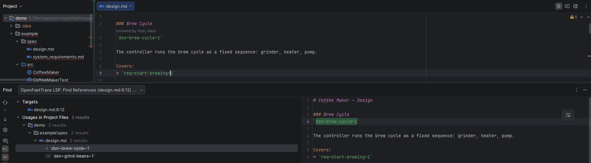

| IntelliJ IDEA | VS Code |
|---|---|
| `Alt+F7` | `Shift+F12` |

## Symbol search

Specification items appear in the editor's workspace symbol search, matched by
ID or title. Coverage tags stay out of the results, because several tags
typically point at the same item and would bury it under near-identical entries.

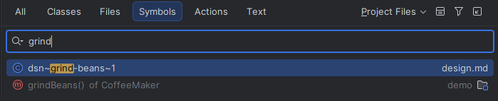

| IntelliJ IDEA | VS Code |
|---|---|
| `Ctrl+Alt+Shift+N` | `Ctrl+T` |

## Trace diagnostics

Defects are reported for **every file in the workspace**, not only the open ones,
and land in the problems view. In IntelliJ they also appear under *Project Errors*.

The severity says what it takes to get rid of the defect:

| Severity | Meaning | Examples                                                                                                                                                                      |
|---|---|-------------------------------------------------------------------------------------------------------------------------------------------------------------------------------|
| **Error** | Text that is already there is wrong | Reference to an item that does not exist, reference to another revision, an ID defined twice, a coverage cycle                                                                |
| **Warning** | The trace is merely unfinished | An artifact type without coverage, coverage the target's `Needs` list does not ask for                                                                                        |
| **Information** | Not this item's doing at all | Something further down the chain is incomplete ([transitive defects](https://github.com/itsallcode/openfasttrace/blob/main/doc/user_guide/user_guide.md#transitive-defects)). |                                                                |

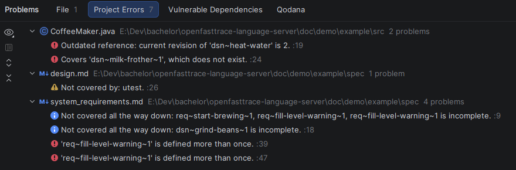

| IntelliJ IDEA | VS Code |
|---|---|
| `Alt+6` | `Ctrl+Shift+M` |

## Quick fix

When a coverage tag names a revision the item no longer has, the diagnostic
carries a fix. It is offered at **both ends** of the link.

On the tag you get *Update to `req~login~2`* for that one tag, and from the
second outdated reference on also *Update all N references*. On the item itself,
where raising a revision is what left the tags behind, the bulk action is offered
right away.

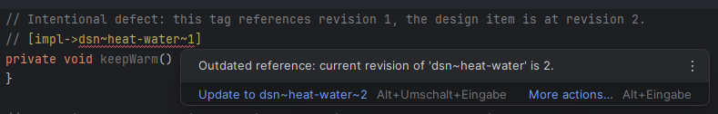

| IntelliJ IDEA | VS Code |
|---|---|
| `Alt+Enter` | `Ctrl+.` |

## Coverage code lens

A line above each specification item names the artifact types it still needs and
the ones already covering it, for example **missing utest · covered by impl**.

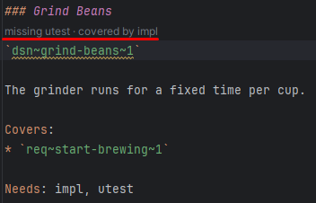

## Coverage hierarchy

The coverage chain as a tree, always starting at the top no matter where in the
chain you open it: downwards the items covering an item, ending at the coverage
tags in the source code.

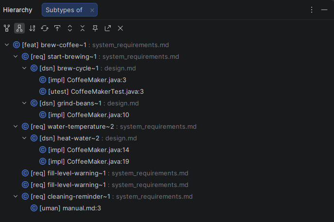

| IntelliJ IDEA | VS Code |
|---|---|
| `Ctrl+H` | *Show Type Hierarchy* in the context menu |

## Code completion

Three places where completion helps:

**In a `Covers:` list** and **in the target half of a coverage tag** (`[impl->req~lo`),
matching item IDs are suggested, ranked by match quality. In a tag only items whose
`Needs` list contains the tag's artifact type are offered, and the closing bracket
is added for you. 

**In a comment**, pressing the completion shortcut offers a skeleton such as
`[impl->...]` for every artifact type the workspace needs, including project
specific ones.

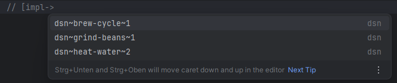

| IntelliJ IDEA | VS Code |
|---|---|
| `Ctrl+Space` | `Ctrl+Space` |

## Rename

Renaming a specification item changes its declaration together with every
coverage tag and `Covers:` entry in the workspace, in one step.

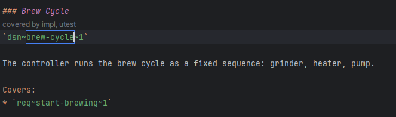

| IntelliJ IDEA | VS Code |
|---|---|
| `Shift+F6` | `F2` |

## Trace report

The full OpenFastTrace report, rendered on request and opened in the editor. As
HTML or as plain text in several levels of detail, from every item down to a
one-line summary.

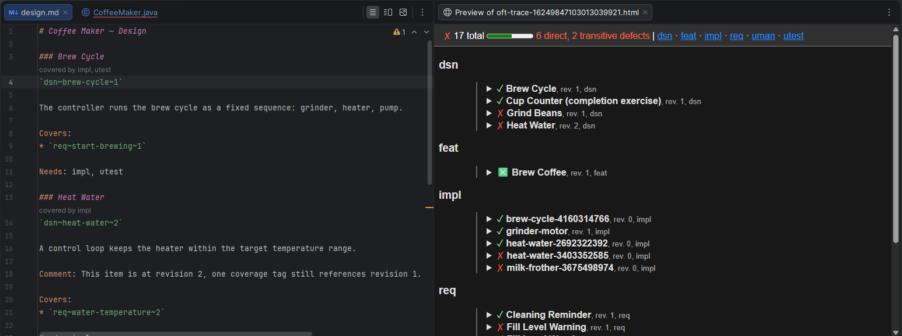

| IntelliJ IDEA | VS Code |
|---|---|
| *Tools → Generate OpenFastTrace Report…* | Command palette → *OpenFastTrace: Generate Trace Report* |

## Ignore file

A `.oftignore` file in the workspace root lists glob patterns, one per line, and
keeps matching paths out of every OFT feature. Blank lines and lines starting
with `#` are skipped, and a pattern matching a directory excludes everything
below it.

```gitignore
# generated documentation takes no part in the trace
doc/generated
**/*.tmp
```

Build output (`target`, `build`, `out`, `dist`, `node_modules`) and hidden paths
are excluded by default, at every depth, so the file is only needed for anything
beyond that.

Changes take effect as soon as the file is saved.

## Trace decisions

An [architecture decision record](https://adr.github.io/) is a decision written in
Markdown that code is supposed to carry out, which is what a specification item is.
Put the cursor on the title of a record in a `decisions` or `adr` directory and the
code action inserts an ID built from the file name:

```markdown
# Cache the Workspace Index on Disk
`adr~cache-the-workspace-index-on-disk~1`

Needs: impl
```

From there `// [impl->adr~cache-the-workspace-index-on-disk~1]` links the code to
the decision, and every feature above works with it.

| IntelliJ IDEA | VS Code |
|---|---|
| `Alt+Enter` | `Ctrl+.` |
